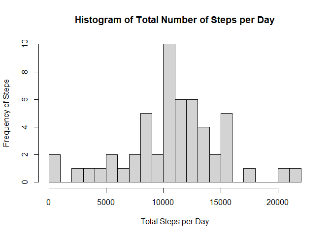
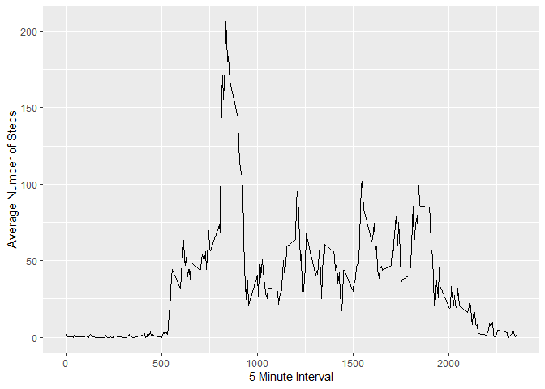
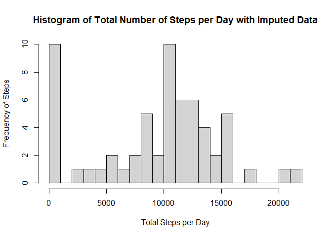
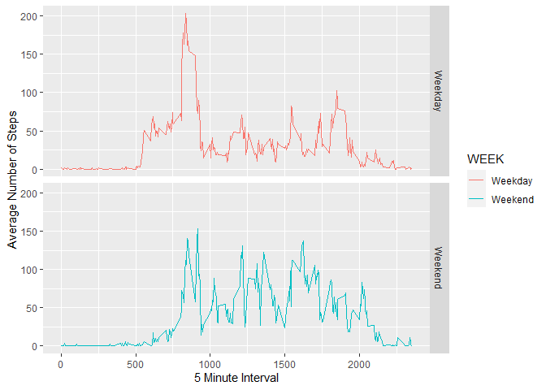

```r
## Loading and preprocessing the data
##1. Load the data (i.e. `read.csv()`)


library(dplyr)
options(dplyr.summarise.inform = FALSE) ## gets rid of a pesky "summarise()` ungrouping output (override with `.groups` argument)" message instead of fixing the problem
library(data.table)
library(ggplot2)
if (!exists("activity.csv")) {
  unzip("activity.zip")
}
##2. Process/transform the data (if necessary) into a format suitable for your analysis
activity <- fread("activity.csv")
```


```r
## What is mean total number of steps taken per day?

steps <- activity %>% group_by(date) %>% summarise(steptotal = sum(steps)) %>% na.omit()

#1. Make a histogram of the total number of steps taken each day


hist(steps$steptotal, ylab = "Frequency of Steps", xlab = "Total Steps per Day", breaks = 25, main = "Histogram of Total Number of Steps per Day")
```

<!-- -->


```r
#2. Calculate and report the **mean** and **median** total number of steps taken per day

####Calculate and report the mean and median of the total number of steps taken per day

meansteptotal <- mean(steps$steptotal)
mediansteptotal <- median(steps$steptotal)
```
Average Number of Steps Taken per Day: 1.0766189\times 10^{4}

Median Number of Steps Taken per Day: 10765


```r
####What is the average daily activity pattern?
adap <- activity %>% group_by(interval) %>% na.omit() %>% summarise(stepint =mean(steps))
```


```r
#1. Make a time series plot (type = "l") of #the 5-minute interval (x-axis) and the average number of steps taken, averaged across all days (y-axis)

ggplot(adap, aes(interval, stepint)) + geom_line() + xlab("5 Minute Interval") + ylab("Average Number of Steps") 
```

<!-- -->


```r
#2. Which 5-minute interval, on average across all the days in the dataset, #contains the maximum number of steps?
maxstep <- adap[which.max(adap$stepint),]
```
The 5-Minute Interval with the Maximum Number of Steps: 835


```r
## Imputing missing values
#### 1. Calculate and report the total number of missing values in the ####dataset (i.e. the total number of rows with `NA`s)
missing <- sum(is.na(activity$steps))
```
Total Missing Values: 2304


```r
#### 2. Devise a strategy for filling in all of the missing values in the dataset. The strategy does not need to be sophisticated. For example, you could use the mean/median for that day, or the mean for that 5-minute interval, etc.
library(Hmisc)
imput <- impute(activity$steps, fun = mean) ### default function is median and this will never be called
```


```r
#### 3. Create a new dataset that is equal to the original dataset but with the missing data filled in.
activity$ImputedSteps <- impute(activity$steps) 
```


```r
#### 4. Make a histogram of the total number of steps taken each day and Calculate and report the **mean** and **median** total number of steps taken per day. Do these values differ from the estimates from the first part of the assignment? What is the impact of imputing missing data on the estimates of the total daily number of steps?
imputsteps <- activity %>% group_by(date) %>% summarise(steptotal = sum(ImputedSteps))
hist(imputsteps$steptotal, ylab = "Frequency of Steps", xlab = "Total Steps per Day", breaks = 25, main = "Histogram of Total Number of Steps per Day with Imputed Data")
```

<!-- -->

```r
mean(imputsteps$steptotal)
median(imputsteps$steptotal)
```
Average Imputed Steps: 9354.2295082

Median Imputed Steps: 1.0395\times 10^{4}


```r
## Are there differences in activity patterns between weekdays and weekends?

#1. Create a new factor variable in the dataset with two levels -- "weekday" and "weekend" indicating whether a given date is a weekday or weekend day.
imputsteps$day <- weekdays(imputsteps$date)
activity$day <- weekdays(activity$date)
activity$ImputedSteps <- impute(activity$steps)

activity$WEEK <- ifelse(activity$day == "Saturday" | activity$day == "Sunday", "Weekend", "Weekday")
dayends <- aggregate(activity$ImputedSteps, by = list(activity$WEEK, activity$interval), na.omit(mean))
names(dayends) <- c("WEEK", "interval", "steps")
#1. Make a panel plot containing a time series plot (i.e. `type = "l"`) of the 5-minute interval (x-axis) and the average number of steps taken, averaged across all weekday days or weekend days (y-axis). 
ggplot(dayends, aes(x= interval, y = steps, color = WEEK)) + geom_line() + facet_grid(WEEK ~.) + xlab("5 Minute Interval") + ylab("Average Number of Steps")
```

<!-- -->
